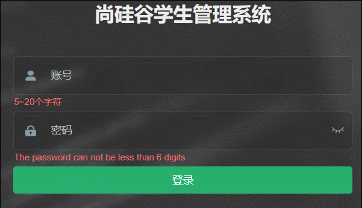

# 一、HTML 入门

## 1、HTML & CSS & JavaScript 的作用

HTML 主要用于网页主体结构的搭建


CSS 主要用于页面元素美化


JavaScript 主要用于页面元素的动态处理



##  2、HTML 简介

HTML 是 Hyper Text Markup Language 的缩写，意思是超文本标记语言。它的作用是搭建网页结构，在网页上展示内容。

HTML5 是 HyperText Markup Language 5 的缩写，HTML5 技术结合了 [HTML4.01 的相关标准](https://baike.baidu.com/item/相关标准/5199682?fromModule=lemma_inlink "相关标准")并革新，符合现代网络发展要求，在 2008 年正式发布。HTML5 由不同的技术构成，其在互联网中得到了非常广泛的应用，提供更多增强[网络应用](https://baike.baidu.com/item/网络应用/2196523?fromModule=lemma_inlink "网络应用")的标准机。与传统的技术相比，HTML5 的语法特征更加明显，并且结合了 [SVG](https://baike.baidu.com/item/SVG/63178?fromModule=lemma_inlink "SVG") 的内容。这些内容在网页中使用可以更加便捷地处理多媒体内容，而且 HTML5 中还结合了其他元素，对原有的功能进行调整和修改，进行[标准化工作](https://baike.baidu.com/item/标准化工作/9777788?fromModule=lemma_inlink "标准化工作")。HTML5 在 2012 年已形成了稳定的版本。2014 年 10 月 28 日，W3C 发布了 HTML5 的最终版。

### 超文本

HTML 文件本质上是文本文件，而普通的文本文件只能显示字符。但是 HTML 技术则通过 HTML 标签把其他网页、图片、音频、视频等各种多媒体资源引入到当前网页中，让网页有了非常丰富的呈现方式，这就是超文本的含义——本身是文本，但是呈现出来的最终效果超越了文本。

### 标记语言

说 HTML 是一种『标记语言』是因为它是由一系列『标签』组成的，与 Java 这样的『编程语言』不同，没有常量、变量、流程控制、异常处理、IO 等等这些功能。HTML 很简单，每个标签都有它固定的含义和确定的页面显示效果。

标记语言的常见语法：

-   双标签：标签是通过一组尖括号 + 标签名的方式来定义的

```html
<p>HTML is a very popular fore-end technology.</p>
```

这个例子中使用了一个 p 标签来定义一个段落，`<p>` 叫**开始标签**，`</p>` 叫**结束标签**。开始标签和结束标签一起构成了一个完整的标签。开始标签和结束标签之间的部分叫**文本标签体**，也简称**标签体**。

-   单标签

```html
<input type="text" name="username" />
```

-   属性

```html
<a href="http://www.xxx.com">show detail</a>
```

href="网址" 就是属性，`href` 是属性名，"网址"是属性值

## 3、HTML基础结构

**1）文档声明**

HTML 文件中第一行的内容，用来告诉浏览器当前 HTML 文档的基本信息，其中最重要的就是当前 HTML 文档遵循的语法标准。这里我们只需要知道 HTML 有 4 和 5 这两个大的版本

+ HTML4 版本的文档类型声明是：

```HTML
<!DOCTYPE HTML PUBLIC "-//W3C//DTD HTML 4.01 Transitional//EN"
"http://www.w3.org/TR/html4/loose.dtd">
```

+ HTML5 版本的文档类型声明是：

``` html
<!DOCTYPE html>
```

现在主流的技术选型都是使用 HTML5，之前的版本基本不用了。

**2）根标签**

html 标签是整个文档的根标签，所有其他标签都必须放在 html 标签里面。html 根标签下有两个一级子标签：头标签 `head` 和体标签 `body`

**3）头部元素**

head 标签用于定义文档的头部，其他头部元素都放在 head 标签里。头部元素包括 `title` 标签、`script` 标签、`style` 标签、`link` 标签、`meta` 标签等等。head 标签定义那些不直接展示在页面主体上，但是又很重要的内容，如字符集、CSS 引入、JS 引入等

**4）主体元素**

body 标签定义网页的主体内容，在浏览器窗口内显示的内容都定义到 body 标签内。

**5）注释**

HTML 注释的写法是

``` html
<!-- 注释内容 -->
```


## 4、HTML 的入门程序

第一步：准备一个纯文本文件，拓展名为 `html`

第二步：使用记事本打开文件，在文件内开发代码

``` html
<!DOCTYPE html>
<html lang="en">
	<head>
        <!--告诉浏览器用什么字符集对文件解码-->
        <meta charset="UTF-8" />
        <title>我的第一个网页</title>
    </head>
    <body>
        hello html!!!
    </body>
</html>
```

第三步：使用浏览器打开文件，查看显示的内容


## 5、HTML 概念词汇解释

1、标签 `tag`

+ 代码中的一个 `<>` 叫做一个标签，有些标签成对出现，称之为双标签。有些标签单独出现，称之为单标签。

2、属性 `attribute`

+ 一般在开始标签中，用于定义标签的一些特征

3、文本 `text`

+ 双标签中间的文字，包含空格换行等结构

4、元素 `element`

+ 经过浏览器解析后，每一个完整的标签（标签 + 属性 + 文本）可以称之为一个元素

## 6、HTML 的语法规则

1. 根标签有且只能有一个
2. 无论是双标签还是单标签都需要正确关闭
3. 标签可以嵌套但不能交叉嵌套
4. 注释语法为 `<!-- -->`，注意不能嵌套
5. 属性必须有值，值必须加引号，H5 中属性名和值相同时可以省略属性值
6. HTML 中使用字符串时不严格区分单双引号，但字符串嵌套时单双引号要交替使用，如："abcd'e'fgh"
7. HTML 标签不严格区分大小写，但是不能大小写混用，错误示范：`<html></HTML>`、`<INput />`，一般建议小写
8. HTML 中不允许自定义标签名，强行自定义则无效

## 7、开发工具 VSCode 的安装和使用

前端工程师 “Front-End-Developer” 源自于美国。大约从 2005 年开始正式的前端工程师角色被行业所认可，到了 2010 年，互联网开始全面进入移动时代，前端开发的工作越来越重要。

最初所有的开发工作都是由后端工程师完成的，随着业务越来越繁杂，工作量变大，于是我们将项目中的可视化部分和一部分交互功能的开发工作剥离出来，形成了前端开发。由于互联网行业的急速发展，导致了在不同的国家，有着截然不同的分工体制。

在日本和一些人口比较稀疏的国家，例如加拿大、澳大利亚等，流行 “Full-Stack Engineer”，也就是我们通常所说的全栈工程师。通俗点说就是一个人除了完成前端开发和后端开发工作以外，有的公司从产品设计到项目开发再到后期运维可能都是同一个人，甚至可能还要负责 UI、配动画，也可以是扫地、擦窗、写文档、维修桌椅等等。

而在美国等互联网环境比较发达的国家项目开发的分工协作更为明确，整个项目开发分为前端、中间层和后端三个开发阶段，这三个阶段分别由三个或者更多的人来协同完成。国内的大部分互联网公司只有前端工程师和后端工程师，中间层的工作有的由前端来完成，有的由后端来完成。

PRD（产品原型—产品经理）— PSD（视觉设计—UI 工程师）— HTML / CSS / JavaScript（PC / 移动端网页，实现网页端的视觉展示和交互—前端工程师）

html 文件是纯文本文件，普通编辑工具都可以编辑

前端工程师比较推崇的一款开发工具就是 Visual Studio Code，下载地址为：<https://code.visualstudio.com/>


1、安装过程

安装过程比较简单，一路 next，注意安装路径不要有中文、空格和特殊符号即可

2、安装插件


+ Auto Rename Tag：自动修改标签对插件
+ Chinese Language Pack：汉化包
+ HTML CSS Support：HTML CSS 支持
+ Intellij IDEA Keybindings：IDEA 快捷键支持
+ Live Server：实时加载功能的小型服务器
+ open in  browser：通过浏览器打开当前文件的插件
+ Prettier-Code formatter：代码美化格式化插件
+ Vetur：VScode 中的 Vue 工具插件
+ vscode-icons：文件显示图标插件
+ Vue 3 snipptes：生成 VUE 模板插件
+ Vue language Features：Vue3 语言特征插件（已改名为 Vue-Official）

3、准备工作空间  

+ `直接用 vscode 打开某个目录`即可直接将某个目录作为项目代码存放的根目录


4、在工作空间下创建目录和文件

+ 点击带有 "+" 号的按钮即可创建文件或者目录


+ 在 html 中，输入 " ! " 并回车即可快速出现 html 的基本结构


5、通过 live Server 小型服务器运行项目

+ 点击右下角 Go Live，或者在 html 编辑视图上右击 open with live Server，会自动启动小型服务器，并自动打开浏览器访问当前资源


+ Live Server 实时加载功能


+ Live Server 使用完毕后，要记得关闭


6、其他常见设置

+ 设置字体：齿轮 > search > 搜索 "字体大小"
+ 设置字体大小可以用滚轮控制:  齿轮 > 设置 > 搜索 "Mouse Wheel Zoom"
+ 设置左侧树缩进：齿轮 > 设置 > 搜索 "树缩进"
+ 设置文件夹折叠：齿轮 > 设置 > 搜索 "compact" 取消第一个勾选
+ 设置编码自动保存：齿轮 > 设置 > 搜索 "Auto Save"，选择为 "afterDelay"

> 在线帮助文档：<http://www.w3school.com.cn>

# 二、HTML 常见标签

##  1、标题标签

> 标题标签一般用于在页面上定义一些标题性的内容，如新闻标题、文章标题等，有 `h1` 到 `h6` 六级标题

+ 代码

``` html
<body>
    <h1>一级标题</h1>
    <h2>二级标题</h2>
    <h3>三级标题</h3>
    <h4>四级标题</h4>
    <h5>五级标题</h5>
    <h6>六级标题</h6>
</body>
```

+ 效果


## 2、段落标签

> 段落标签 `p` 一般用于定义一些在页面上要显示的大段文字，多个段落标签之间实现自动分段的效果

+ 代码

``` html
<body>
    <p>
        记者从工信部了解到，近年来我国算力产业规模快速增长，年增长率近30%，算力规模排名全球第二。
    </p>
    <p>
        工信部统计显示，截至去年底，我国算力总规模达到180百亿亿次浮点运算/秒，存力总规模超过1000EB（1万亿GB）。
        国家枢纽节点间的网络单向时延降低到20毫秒以内，算力核心产业规模达到1.8万亿元。中国信息通信研究院测算，
        算力每投入1元，将带动3至4元的GDP经济增长。
    </p>
    <p> 
        近年来，我国算力基础设施发展成效显著，梯次优化的算力供给体系初步构建，算力基础设施的综合能力显著提升。
        当前，算力正朝智能敏捷、绿色低碳、安全可靠方向发展。
    </p>
</body>
```

+ 效果


## 3、换行标签

> 单纯实现换行的标签是 `br`，如果想添加分隔线，可以使用 `hr` 标签

+ 代码

``` html
<body>
        工信部统计显示，截至去年底，我国算力总规模达到180百亿亿次浮点运算/秒，存力总规模超过1000EB（1万亿GB）。
    <br>
        国家枢纽节点间的网络单向时延降低到20毫秒以内，算力核心产业规模达到1.8万亿元。
    <hr>
        中国信息通信研究院测算，算力每投入1元，将带动3至4元的GDP经济增长。
</body>
```

+ 效果


## 4、列表标签

> 有序列表：分条列项展示数据的标签，其每一项前面的符号带有顺序特征
>
> * 列表标签 `ol`
> * 列表项标签 `li`

+ 代码

``` html
<ol>
    <li>JAVA</li>
    <li>前端</li>
    <li>大数据</li>
</ol>
```

+ 效果


> 无序列表：分条列项展示数据的标签，其每一项前面的符号不带有顺序特征
>
> * 列表标签 `ul`
> * 列表项标签 `li`

+ 代码

``` html
<ul>
    <li>JavaSE</li>
    <li>JavaEE</li>
    <li>数据库</li>
</ul>
```

+ 效果


> 嵌套列表：列表和列表之间可以嵌套，实现某一项内容详细展示

+ 代码

``` html
<ol>
    <li>
        Java
        <ul>
            <li>JavaSE</li>
            <li>JavaEE</li>
            <li>数据库</li>
        </ul>
    </li>
    <li>前端</li>
    <li>大数据</li>
</ol>
```

+ 效果


## 5、超链接标签

> 点击后带有链接跳转的标签，也叫作 `a` 标签

+ `href` 属性用于定义链接，即要跳转的目标资源的地址
    + href 中可以使用绝对路径，以 / 开头，无论当前资源在哪，始终以一个固定路径作为基准路径作为出发点
    + href 中也可以使用相对路径，不以 / 开头，以当前文件所在路径为出发点去找目标资源
      + 若以 `./` 开头，表示当前资源的所在路径，可以省略不写
      + 若以 `../` 开头，表示当前资源的上一层路径，需要时必须显式写出
    + href 中也可以定义完整的 URL
+ `target` 用于定义目标资源打开的方式
    +  `_blank` 在新窗口中打开目标资源
    +   `_self`  在当前窗口中打开目标资源

代码示例：

``` html
<body>
   <a href="01html的基本结构.html" target="_blank">相对路径本地资源连接</a>
   <br>
   <a href="/day01-html/01html的基本结构.html" target="_self">绝对路径本地资源连接</a>
   <br>
   <a href="http://www.atguigu.com" target="_blank">外部资源链接</a> <br>
   
</body>
```

效果：


## 6、多媒体标签

1、`img` 标签

> img 图片标签，用于在页面上引入图片

属性：

* `src`：用于定义图片的链接 / 路径，可以写完整 url，也可以写相对路径，还可以写绝对路径
* `title`：用于定义鼠标悬停时显示的文字
* `alt`：用于定义图片加载失败时显示的提示文字

代码示例：

``` html

```

效果：


2、`audio` 标签

> audio 用于在页面上引入一段声音

属性：

* `src`：用于定义目标声音资源
* `autoplay`：用于控制打开页面时是否自动播放
* `controls`：用于控制是否展示控制面板
* `loop`：用于控制是否进行循环播放

代码示例：

``` html
 <audio src="img/music.mp3" autoplay="autoplay" controls="controls" loop="loop" />
```

效果：


3、`video` 标签

> video 用于在页面上引入一段视频

属性：

* `src`：用于定义目标视频资源
* `autoplay`：用于控制打开页面时是否自动播放
* `controls`：用于控制是否展示控制面板
* `loop`：用于控制是否进行循环播放

代码示例：

``` html
<video src="img/movie.mp4" autoplay="autoplay" controls="controls" loop="loop" width="400px" />
```

效果：


## 7、表格标签

1、常规表格

+ `table` 标签：代表表格
+ `thead` 标签：代表表头，可以省略不写
+ `tbody` 标签：代表表体，可以省略不写
+ `tfoot` 标签：代表表尾，可以省略不写
+ `tr` 标签：代表一行
+ `td` 标签：代表行内的一格
+ `th` 标签：自带加粗和居中效果的 td

若不区分 thead、tbody 和 tfoot，浏览器在解析 table 表格时会自动为所有 tr 外层补充上 tbody

代码示例：

``` html
<h3 style="text-align: center;">员工技能竞赛评分表</h3>

<table border="1px" style="margin: 0px auto; width: 300px;">
    <thead>
        <tr>
            <!-- <td>排名</td>
			<td>姓名</td>
			<td>分数</td> -->
            <th>排名</th>
            <th>姓名</th>
            <th>分数</th>
        </tr>
    </thead>

    <tbody>
        <tr>
            <td>1</td>
            <td>张小明</td>
            <td>100</td>
        </tr>
        <tr>
            <td>2</td>
            <td>李小东</td>
            <td>99</td>
        </tr>
        <tr>
            <td>3</td>
            <td>王小虎</td>
            <td>98</td>
        </tr>
    </tbody>

    <tfoot></tfoot>
</table>

<br><hr>

<!-- 也可不区分 thead、tbody 和 tfoot -->
<table border="1px" style="margin: 0px auto; width: 300px;">
    <tr>
        <th>排名</th>
        <th>姓名</th>
        <th>分数</th>
    </tr>

    <tr>
        <td>1</td>
        <td>张小明</td>
        <td>100</td>
    </tr>
    <tr>
        <td>2</td>
        <td>李小东</td>
        <td>99</td>
    </tr>
    <tr>
        <td>3</td>
        <td>王小虎</td>
        <td>98</td>
    </tr>
</table>
```

展示效果：


2、单元格跨行

+ 通过 `td` 的 `rowspan` 属性实现上下跨行


代码示例：

``` html
<h3 style="text-align: center;">员工技能竞赛评分表</h3>

<table  border="1px" style="width: 400px; margin: 0px auto;">
    <tr>
        <th>排名</th>
        <th>姓名</th>
        <th>分数</th>
        <th>备注</th>
    </tr>
    <tr>
        <td>1</td>
        <td>张小明</td>
        <td>100</td>
        <td rowspan="3">
            前三名升职加薪
        </td>
    </tr>
    <tr>
        <td>2</td>
        <td>李小东</td></td>
		<td>99</td>
	</tr>
	<tr>
    	<td>3</td>
	    <td>王小虎</td>
    	<td>98</td>
	</tr>
</table>
```

效果：


3、单元格跨行

+ 通过 `td` 的 `colspan` 属性实现左右的跨列


代码示例：

``` html
<h3 style="text-align: center;">员工技能竞赛评分表</h3>

<table  border="1px" style="width: 400px; margin: 0px auto;">
    <tr>
        <th>排名</th>
        <th>姓名</th>
        <th>分数</th>
        <th>备注</th>
    </tr>
    <tr>
        <td>1</td>
        <td>张小明</td>
        <td>100</td>
        <td rowspan="6">
            前三名升职加薪
        </td>
    </tr>
    <tr>
        <td>2</td>
        <td>李小东</td></td>
		<td>99</td>
	</tr>
    <tr>
        <td>3</td>
        <td>王小虎</td>
        <td>98</td>
    </tr>
    <tr>
        <td>总人数</td>
        <td colspan="2">2000</td>
    </tr>
    <tr>
        <td>平均分</td>
        <td colspan="2">90</td>
    </tr>
    <tr>
        <td>及格率</td>
        <td colspan="2">80%</td>
    </tr>
</table>
```

效果：


> VSCode 中快速写三个 td 标签的方法：直接敲 td*3
>
> 快速实现三行三列：直接敲 tr\*3>td\*3

## 8、表单标签

> 表单标签是可以实现让用户在界面上输入各种信息并提交的一种标签，是向服务端发送数据主要的方式之一

1、`form` 标签

form 标签，表单标签，其内部用于定义可以让用户输入信息的表单项标签
+ `action` ：form 标签的属性之一，用于定义信息提交的服务器的地址，地址可写完整 url / 相对地址 / 绝对路径
+ `method`，form 标签的属性之一，用于定义信息的提交方式
    + `get` 方式
      + 数据会缀到 url 后提交，以 ? 作为参数开始的标识，多个参数用 & 隔开，url？key=value&key=value&key=value
      + 数据直接暴露在地址栏上，相对不安全。
      + 地址栏长度有限，所以提交的数据量不大。
      + 地址栏上只能是字符，不能提交文件。相比于 post 方式效率高一些
    + `post` 方式
      + 数据会单独打包通过请求体发送，提交的数据量比较大。
      + 参数默认不会在缀到 url 后。
      + 数据不会直接暴露在地址栏上，相对安全。
      + 请求体中可以是字符，也可以是字节数据，可以提交文件

2、`input` 标签

input 标签，主要的表单项标签，可以用于定义表单项。表单项标签即用户输入信息的标签

+ `name` 属性：input 标签的属性之一，用于定义提交的参数名。表单项标签一定要定义 name 属性
+ 表单项还可以定义 `value` 属性，该属性用于明确提交时的实参
+ `type` 属性：input 标签的属性之一，用于定义输入信息的表单项类型，其属性值有：
    + `text` 单行普通文本框
    + `password` 密码框
    + `submit` 提交按钮
    + `reset` 重置按钮

代码示例：

``` html
<form action="http://www.atguigu.com" method="get">
    用户名： <input type="text" name="username" /> <br>
    密码： <input type="password" name="password" /> <br>
    <input type="submit" value="登录" />
    <input type="reset" value="重置" />
</form>
```

效果：


## 9、常见表单项标签

> 1、单行文本框 `text`

+ 代码

``` html
个性签名：<input type="text" name="signal"/><br/>
```

+ 效果


> 2、密码框 `password`

+ 代码

``` html
密码：<input type="password" name="secret"/><br/>
```

+ 效果


> 3、单选框 `radio`，多个选项选其一

* 说明：

  + name 属性相同的 radio 为一组，组内互斥

  + 当用户选择了一个 radio 并提交表单，这个 radio 的 name 属性和 value 属性组成一个键值对发送给服务器

  + 设置 `checked="checked"` 属性设置默认被选中的 radio

  + 如果属性名和属性值一样的话，可以省略属性值，只写 checked 即可

+ 代码

``` html 
你的性别是：
<!-- <input type="radio" name="gender" value="1" checked="true"> 男 -->
<!-- <input type="radio" name="gender" value="1" checked="checked"> 男 -->
<input type="radio" name="gender" value="1" checked> 男
<input type="radio" name="gender" value="0"> 女
```

+ 效果


> 4、复选框 `checkbox`，多个选项选多个

说明：设置 `checked="checked"` 属性设置默认被选中的 checkbox

+ 代码

``` html
你喜欢的球队是：
<input type="checkbox" name="team" value="Brazil"/>巴西
<input type="checkbox" name="team" value="German" checked/>德国
<input type="checkbox" name="team" value="France"/>法国
<input type="checkbox" name="team" value="China" checked="checked"/>中国
<input type="checkbox" name="team" value="Italian"/>意大利
```

+ 效果


> 5、下拉框 `select`

* 说明：

  + 下拉列表用到了两种标签，其中 `select` 标签用来定义下拉列表，而 `option` 标签设置列表项。

  + `name` 属性在 select 标签中设置，`value` 属性在 option 标签中设置。

  + option 标签的标签体是显示出来给用户看的，提交到服务器的是 value 属性的值。

  + 通过在 option 标签中设置 `selected="selected"` 属性实现默认选中的效果。

+ 代码

``` html
你喜欢的运动是：
<select name="interest">
    <option value="swimming">游泳</option>
    <option value="running">跑步</option>
    <option value="shooting" selected="selected">射击</option>
    <option value="skating">溜冰</option>
</select>
```

+ 效果


> 6、按钮 `button`

* 说明：

  + 普通按钮：点击后无效果，需要通过 JavaScript 绑定单击响应函数

  + 重置按钮：点击后将表单内的所有表单项都恢复为默认值

  + 提交按钮：点击后提交表单

+ 代码

``` html
<button type="button">普通按钮</button>
<input type="button" value="普通按钮"/>

<button type="reset">重置按钮</button>
<input type="reset" value="重置按钮"/>

<button type="submit">提交按钮</button>
<input type="submit" value="提交按钮"/>
```

+ 效果


> 7、隐藏域 `hidden`

+ 说明：
  + 通过表单隐藏域设置的表单项不会显示到页面上，用户看不到。但是提交表单时会一起被提交。用来设置一些需要和表单一起提交但是不希望用户看到的数据，例如用户 id 等等。
  + 若希望用户提交一些特定的信息，但是考虑安全问题或者是用户操作问题，不希望该数据发生改变，除了隐藏域还可以考虑使用 `readonly` 和 `disabled`
    + readonly：只读，提交时携带
    + disabled：不可用，提交时不携带

+ 代码

``` html
<input type="hidden" name="userId" value="2233"/>
<br>
<input type="text" name="pid" value="456" readonly>
<br>
<input type="text" name="tid" value="789" disabled>
```

> 8、多行文本框 `textarea`

说明：textarea 没有 value 属性，如果要设置默认值需要写在开始和结束标签之间。

+ 代码

``` html
自我介绍：<textarea name="desc"></textarea>
```

+ 效果


> 9、文件标签 `file`

说明：不同浏览器显示的样式有微小差异

+ 代码

``` html
头像:<input type="file" name="file"/>
```

+ 效果


## 10、布局相关标签

1、`div` 标签

俗称 ''块"，主要用于划分页面结构，做页面布局。div 是一种块元素，块元素即自己独占一行的元素，块元素的 CSS 样式的宽、高等等往往都是生效的

2、`span` 标签

俗称 "层"，主要用于划分元素范围，配合 CSS 做页面元素样式的修饰。span 是一种行内元素，行内元素即不会自己独占一行的元素，行内元素的 CSS 样式的宽、高等等很多都是不生效的

+ 代码示例：

``` html
<div style="width: 500px; height: 400px;background-color: cadetblue;">
    <div style="width: 400px; height: 100px;background-color: beige;margin: 10px auto;">
        <span style="color: blueviolet;">页面开头部分</span>
    </div>
    <div style="width: 400px; height: 100px;background-color: blanchedalmond;margin: 10px auto;">
        <span style="color: blueviolet;">页面中间部分</span>
    </div>
    <div style="width: 400px; height: 100px;background-color: burlywood;margin: 10px auto;">
        <span style="color: blueviolet;">页面结尾部分</span>
    </div> 
</div>
```

+ 展示效果


## 11、特殊字符

对于 html 代码来说，某些符号是有特殊含义的，如果想要显示这些特殊符号，需要进行转义。有特殊含义的符号称为字符实体。详情见：[HTML ISO-8859-1 参考手册](https://www.w3school.com.cn/charsets/ref_html_8859.asp#google_vignette)


+ 代码示例：

``` html
    &lt;span&gt;  <br>
    &lt;a href="http://www.atguigu.com"&gt;尚&nbsp;硅&nbsp;谷&lt;/a&gt; <br>
    &amp;amp;
```

+ 效果


# 三、CSS 的使用

CSS 层叠样式表（英文全称：Cascading Style Sheets 能够对网页中元素位置的排版进行像素级精确控制，支持几乎所有的字体字号样式，拥有对网页对象和模型样式编辑的能力，简单来说美化页面

## 1、CSS 引入方式

> 1、行内式

通过元素开始标签的 `style` 属性引入样式，语法为 `style="样式名:样式值; 样式名:样式值; ......"`

缺点：

+ html 代码和 CSS 样式代码交织在一起，增加阅读难度和维护成本，影响文件大小，影响性能
+ CSS 样式代码仅对当前元素有效，代码重复量高，复用度低不利于维护

代码示例：

```html
<input 
	type="button" 
    value="按钮"
    style="
        display: block;
        width: 60px; 
        height: 40px; 
        background-color: rgb(140, 235, 100); 
        color: white;
        border: 3px solid green;
        font-size: 22px;
        font-family: '隶书';
        line-height: 30px;
        border-radius: 5px;
"/> 
```

效果：


> 2、内嵌式

说明：

+ 内嵌式样式需要在 `head` 标签中通过一对 `style` 标签定义本页面的公共 CSS 样式
+ CSS 样式的作用范围控制要依赖选择器
+ CSS 的样式代码中注释的方式为 `/*   */`
+ 内嵌式虽然对样式代码做了抽取，但是 CSS 代码仍然在 html 文件中
+ 内嵌样式仅仅能作用于当前文件，代码复用度还是不够，不利于网站风格统一

代码示例：

``` html
<head>
    <meta charset="UTF-8">
    <style>
        /* 通过元素选择器确定样式的作用范围 */
        input {
            display: block;
            width: 80px; 
            height: 40px; 
            background-color: rgb(140, 235, 100); 
            color: white;
            border: 3px solid green;
            font-size: 22px;
            font-family: '隶书';
            line-height: 30px;
            border-radius: 5px;
        }
    </style>
</head>
<body>
    <input type="button" value="按钮1"/> <br>
    <input type="button" value="按钮2"/> <br>
    <input type="button" value="按钮3"/> <br>
    <input type="button" value="按钮4"/> <br>
</body>
```

效果：


> 3、连接式 / 外部样式表

可以在项目单独创建 CSS 样式文件，专门用于存放 CSS 样式代码


在 `head` 标签中，通过 `link` 标签引入外部 CSS 样式即可

``` html
<head>
    <meta charset="UTF-8">
    <link href="css/buttons.css" rel="stylesheet" type="text/css"/>
</head>
<body>
    <input type="button" value="按钮1"/>
    <input type="button" value="按钮2"/>
    <input type="button" value="按钮3"/>
    <input type="button" value="按钮4"/>
</body>
```

说明：
+ CSS 样式代码从 html 文件中剥离，利于代码的维护
+ CSS 样式文件可以被多个不同的 html 引入，利于网站风格统一

## 2、CSS 选择器

> 1、元素选择器

说明：

+ 根据标签名确定样式的作用范围
+ 语法为：`元素名（标签名）{ }`
+ 样式只能作用到同名标签上，其他标签不可用
+ 相同的标签未必需要相同的样式，会造成样式的作用范围太大

代码示例：

``` html
<head>
    <meta charset="UTF-8">
    <style>
        input {
            display: block;
            width: 80px; 
            height: 40px; 
            background-color: rgb(140, 235, 100); 
            color: white;
            border: 3px solid green;
            font-size: 22px;
            font-family: '隶书';
            line-height: 30px;
            border-radius: 5px;
        }
    </style>
</head>
<body>
    <input type="button" value="按钮1"/> <br>
    <input type="button" value="按钮2"/> <br>
    <input type="button" value="按钮3"/> <br>
    <input type="button" value="按钮4"/> <br>
    <button>按钮5</button>
</body>
```

效果：


> 2、id 选择器

说明：

+ 根据元素 id 属性的值确定样式的作用范围
+ 语法为： `#id值 { }`
+ id 属性的值在页面上具有唯一性，所有 id 选择器也只能影响一个元素的样式
+ 因为 id 属性值不够灵活，所以使用该选择器的情况较少

代码示例：

``` html
<head>
    <meta charset="UTF-8">
    <style>
        #btn1 {
            display: block;
            width: 80px; 
            height: 40px; 
            background-color: rgb(140, 235, 100); 
            color: white;
            border: 3px solid green;
            font-size: 22px;
            font-family: '隶书';
            line-height: 30px;
            border-radius: 5px;
        }
    </style>
</head>
<body>
    <input id="btn1" type="button" value="按钮1"/> <br>
    <input id="btn2" type="button" value="按钮2"/>
    <input id="btn3" type="button" value="按钮3"/>
    <input id="btn4" type="button" value="按钮4"/>
    <button id="btn5">按钮5</button>
</body>
```

效果：


> 3、class 选择器

说明：

+ 根据元素 class 属性的值确定样式的作用范围
+ 语法为：`.class属性值 { }`
+ class 属性值可以有一个，也可以有多个，多个不同的标签也可以使用相同的 class 值
+ 同一个元素的 class 属性可以有多个值，即多个选择器的样式可以在同一个元素上进行叠加
+ 因为 class 选择器非常灵活，所以在 CSS 中使用该选择器的情况较多

代码示例：

``` html
<head>
    <meta charset="UTF-8">
    <style>
        .shapeClass {
            display: block;
            width: 80px; 
            height: 40px; 
            border-radius: 5px;
        }
        .colorClass {
            background-color: rgb(140, 235, 100); 
            color: white;
            border: 3px solid green;
        }
        .fontClass {
            font-size: 22px;
            font-family: '隶书';
            line-height: 30px;
        }
    </style>
</head>
<body>
    <input  class ="shapeClass colorClass fontClass"type="button" value="按钮1"/> <br>
    <input  class ="shapeClass colorClass" type="button" value="按钮2"/> <br>
    <input  class ="colorClass fontClass" type="button" value="按钮3"/>
    <input  class ="fontClass" type="button" value="按钮4"/> <br>
    <button class="shapeClass colorClass fontClass" >按钮5</button>
</body>
```

效果：


## 3、CSS 浮动

> CSS 的 Float（浮动）使元素脱离文档流，按照指定的方向（左或右）发生移动，直到它的外边缘碰到包含框或另一个浮动框的边框为止。

+ 浮动设计的初衷为了解决文字环绕图片问题，浮动后一定不会将文字挡住，这是设计初衷。
+ 文档流是指文档中可显示对象在排列时所占用的位置 / 空间，而脱离文档流就是在页面中不占位置了。  

浮动原理：

+  当把框 1 向右浮动时，它脱离文档流并且向右移动，直到它的右边缘碰到包含框的右边缘


+ 当框 1 向左浮动时，它脱离文档流并且向左移动，直到它的左边缘碰到包含框的左边缘。因为它不再处于文档流中，所以它不占据空间，实际上覆盖住了框 2，使框 2 从视图中消失。如果把所有三个框都向左移动，那么框 1 向左浮动直到碰到包含框，另外两个框向左浮动直到碰到前一个浮动框。


+  如果包含框太窄，无法容纳水平排列的三个浮动元素，那么其它浮动块向下移动，直到有足够的空间。如果浮动元素的高度不同，那么当它们向下移动时可能被其它浮动元素“卡住”


> 浮动的样式名：`float`，常见值如下：


通过代码感受浮动的效果：

``` html
<head>
    <meta charset="UTF-8">
    <style>
        .outerDiv {
            width: 500px;
            height: 300px;
            border: 1px solid green;
            background-color: rgb(230, 224, 224);
        }
        .innerDiv {
            width: 100px;
            height: 100px;
            border: 1px solid blue;
            float: left;
        }
        .d1 {
            background-color: greenyellow;
           /*  float: right; */
        }
        .d2 {
            background-color: rgb(79, 230, 124);
        }
        .d3 {
            background-color: rgb(26, 165, 208);
        }
    </style>
</head>
<body>
   <div class="outerDiv">
        <div class="innerDiv d1">框1</div>
        <div class="innerDiv d2">框2</div>
        <div class="innerDiv d3">框3</div>
   </div>
</body>
```

效果：


## 4、CSS 定位

> position 属性指定了元素的定位类型。

+ 这个属性定义建立元素布局所用的定位机制。任何元素都可以定位，不过绝对或固定元素会生成一个块级框，而不论该元素本身是什么类型。相对定位元素会相对于它在正常流中的默认位置偏移。

+ 元素可以使用顶部，底部，左侧和右侧属性定位。然而，这些属性无法工作，除非是先设定 `position` 属性。他们也有不同的工作方式，这取决于定位方法。


> 1、静态定位 `static`

不设置的时候的默认值就是 `static` 静态定位，没有定位，元素出现在该出现的位置，块级元素垂直排列，行内元素水平排列

代码示例：

``` html
<head>
    <meta charset="UTF-8">
    <style>
        .innerDiv {
            width: 100px;
            height: 100px;
        }
        .d1 {
            background-color: rgb(166, 247, 46);
            position: static;
        }
        .d2 {
            background-color: rgb(79, 230, 124);
        }
        .d3 {
            background-color: rgb(26, 165, 208);
        }
    </style>
</head>
<body>
    <div class="innerDiv d1">框1</div>
    <div class="innerDiv d2">框2</div>
    <div class="innerDiv d3">框3</div>
</body>
```

效果：


> 2、绝对定位 `absolute`

说明：
+ absolute 根据浏览器页面边缘来定位，并通过 `top`、`left`、`right`、`bottom` 指定元素在页面上的固定位置
+ 定位后元素会让出原来位置，其他元素可以占用

代码示例：

``` html
<head>
    <meta charset="UTF-8">
    <style>
        .innerDiv {
            width: 100px;
            height: 100px;
        }
        .d1 {
            background-color: rgb(166, 247, 46);
            position: absolute;
            left: 300px;
            top: 100px;
        }
        .d2 {
            background-color: rgb(79, 230, 124);
        }
        .d3 {
            background-color: rgb(26, 165, 208);
        }
    </style>
</head>
<body>
    <div class="innerDiv d1">框1</div>
    <div class="innerDiv d2">框2</div>
    <div class="innerDiv d3">框3</div>
</body>
```

效果：


> 3、相对定位 `relative`

说明：
+ relative 相对于元素自己原来的位置进行定位
+ 定位后保留原来的站位，其他元素不会移动到该位置

代码示例：

``` html
<head>
    <meta charset="UTF-8">
    <style>
        .innerDiv {
                width: 100px;
                height: 100px;
        }
        .d1 {
            background-color: rgb(166, 247, 46);
            position: relative;
            left: 30px;
            top: 30px;
        }
        .d2 {
            background-color: rgb(79, 230, 124);
        }
        .d3 {
            background-color: rgb(26, 165, 208);
        }
    </style>
</head>
<body>
    <div class="innerDiv d1">框1</div>
    <div class="innerDiv d2">框2</div>
    <div class="innerDiv d3">框3</div>
</body>
```

效果：


> 4、固定定位 `fixed`

说明：
+ fixed 始终在浏览器窗口固定位置，不会随着页面的上下移动而移动
+ 元素定位后会让出原来的位置，其他元素可以占用

代码示例：

``` html
<head>
    <meta charset="UTF-8">
    <style>
        .innerDiv {
                width: 100px;
                height: 100px;
        }
        .d1 {
            background-color: rgb(166, 247, 46);
            position: fixed;
            right: 30px;
            top: 30px;
        }
        .d2 {
            background-color: rgb(79, 230, 124);
        }
        .d3 {
            background-color: rgb(26, 165, 208);
        }
    </style>
</head>
<body>
    <div class="innerDiv d1">框1</div>
    <div class="innerDiv d2">框2</div>
    <div class="innerDiv d3">框3</div>
    br*100+tab
</body>
```

效果：


## 5、CSS 盒子模型

> 所有 HTML 元素可以看作盒子，在 CSS 中 `"box model"` 这一术语是用来设计和布局时使用的。

CSS 盒模型本质上是一个盒子，封装周围的 HTML 元素，它包括：边距（margin）、边框（border）、填充（padding）、和实际内容（content）


说明：
+ `Margin` 外边距：清除边框外的区域，外边距是透明的。
+ `Border` 边框：围绕在内边距和内容外的边框。
+ `Padding` 内边距：清除内容周围的区域，内边距是透明的。
+ `Content` 内容：盒子的内容，显示文本和图像。


代码示例：

``` html
<head>
    <meta charset="UTF-8">
    <style>
        .outerDiv {
            width: 800px;
            height: 300px;
            border: 1px solid green;
            background-color: rgb(230, 224, 224);
            margin: 0px auto; /* 实现居中效果 */
        }
        .innerDiv {
            width: 100px;
            height: 100px;
            border: 1px solid blue;
            float: left;
            /* margin-top: 10px;
            margin-right: 20px;
            margin-bottom: 30px;
            margin-left: 40px; */
            /* margin-left,margin-right,margin-top,margin-bottom都被设置为10px */
            /* margin: 10px; */
            /* margin-top和margin-bottom都被设置为10px,margin-left和margin-right都被设置为20px */
            /* margin: 10px 20px; */
            margin: 10px 20px 30px 40px; /* 设置顺序：上右下左，按顺时针方向 */

        }
        .d1 {
            background-color: greenyellow;
            /* padding-top: 10px;
            padding-right: 20px;
            padding-bottom: 30px;
            padding-left: 40px; */
            /* padding-left,padding-right,padding-top,padding-bottom都被设置为30px */
            /* padding: 30px; */
            /* padding-top和padding-bottom都被设置为30px,padding-left和padding-right都被设置为20px */
            /* padding: 30px 20px; */
            padding: 10px 20px 30px 40px;
        }
        .d2 {
            background-color: rgb(79, 230, 124);
        }
        .d3 {
            background-color: rgb(26, 165, 208);
        }
    </style>
</head>
<body>
    <div class="outerDiv">
        <div class="innerDiv d1">框1</div>
        <div class="innerDiv d2">框2</div>
        <div class="innerDiv d3">框3</div>
    </div> 
</body>
```

效果：


在浏览器上通过 F12 工具查看盒子模型状态：


